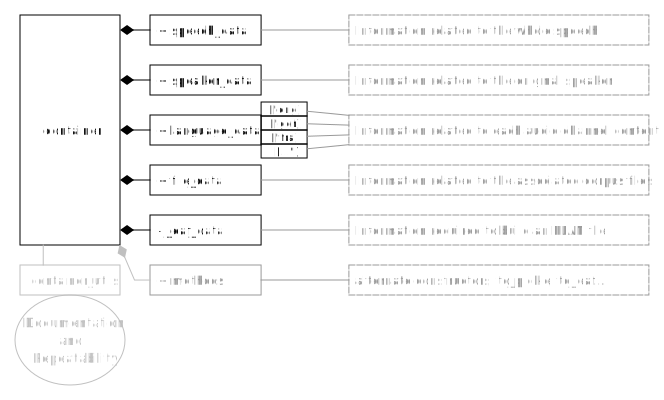

# Top level Structure
Each container has, 5 attributes: 5 dictionaries.
Each dictionary holds a specific type of information:

## speech_data

    self.speech_data    'samples' :                 number of samples in the recording
                        'sample_rate' :             sample rate of recording
                        'length' :                  length in seconds of the recording
                        'orig_lang' :               (not yet set)
                        'orig_lang_kaldi' :         original language as detected by kaldi
                        'kaldi_data' :              data for kaldi decision
                        'orig_lang_zcr' :           original language as determined by zcr-comparison
                        'zcr_data' :                data for zcr decision
                        'orig_lang_whisper' :       original language as determined by whisper
                        'whisper_data' :            data for whisper decision       
                        'orig_lang_sub' :           original language determined by subtracting channels
                        'sub_data' :                data for subtraction decision
                        'diarization:' :            speaker diarization from pyannote
                        'window' :                  most likely speaking window
                        'date' :                    date of the session (sometimes =/= date of the speech)
                        'time' :                    time of the speech
                        'session' :                 number of the session (1-96)
                        'location' :                location of the session (Strasbourg or Brussels)
                        'cycle' :                   number in cycle (4 in Strasbourg, 2 in Brussels)
                        'subject' :                 topic the speech belongs to
                        'chair' :                   person presiding during the speech
                        'orig_w_verbatim_langs' :   original language according to europarl-scrape matching
                        'orig_lang_ed':             original language according to europarl-direct matching
                        'orig_lang_eu' :            original language according to europarl matching

## speaker_data

    self.speaker_data 'name' :      name of the speaker according to europarl-scrape match
                      'group' :     political group of the speaker accroding to europarl-scrapt
                      'gender' :    gender of the speaker
                      'birthday' :  birthday of the speaker
                      'age' :       age of the speaker at the time of the speech
                      'native' :    native language of the speaker
                      'wiki' :      wiki link to the speaker
                      'ed_name':    name of the speaker according to europarl-direct
                      'ed_aff':     political group of the speaker according to europarl-direct
                      'eu_name':    name of the speaker according to europarl
                      'eu_aff' :    political group of the speaker according to europarl-direct
                                            
                      
                      
                      
## language_data

    language_data : 'df_transcription':        Kaldi transcription, phrase level time aligned 
                    'df_confidence':            Kaldi confidence, phrase level
                    'df_is_translation':        Kaldi translation, phrase level
                    'df_manually_corrected':    Whether checked by a human or not, phrase level
                    'relay_interp' :            (not yet set)
                    'retour_interp':            (not yet set)
                    'is_translation_perc' :     Kaldi decision if translation or not
                    'speech_duration' :         Speech duration (sample rate * samples)
                    'verbatim_file' :           europarl-direct verbatim file based on Kaldi
                    'verbatim_speech' :         europarl-direct verbatim report based on Kaldi
                    'verbatim_ratio' :          europarl-direct sequence matcher ratio based on Kaldi
                    'whisper' :                 whisper transcription
                    'interpreter_window' :      most likely (interpreter) speaking window
                    'w_verbatim_speech':        europarl-scrape verbatim speech based on Whisper
                    'w_verbatim_ratio':         europarl-scrape sequence matcher ratio based on Whisper
                    'w_verbatim_file':          europarl-scrape verbatim file based on Whisper
                    'p_verbatim_speech':        Parallelised text according to Whisper + europarl-direct
                    'ed_file':                  europarl-direct verbatim file based on Whisper
                    'ed_ratio' :                europarl-direct sequence matcher ratio based on Whisper
                    'ed_speech' :               europarl-direct verbatim speech based on Whisper
                    'eu_file'   :               europarl verbatim file based on Whisper
                    'eu_ratio'  :               europarl sequence matcher ratio based on Whisper
                    'eu_speech' :               europarl verbatim speech based on Whisper
                      
                      
                      
                      
## file_data

File Data holds information about the mp3, eaf, folder and file. This will only work if the whole corpus tree is cloned from GitHub or the corpus structure is reassembled by hand.

    self.file_data  'mp3_paths' :      path to the original mp3 
                    'eaf_path' :        path to the eaf
                    'folder_name' :     folder name for the recording
                    'file_name':        current filename                    
                    

## _eaf_data¶

The eaf data is not supposed to be accessed, this just holds information to (re-)build an eaf

    self._eaf_data  'time_dictionary' :      the time dictionary data from the original eaf
                      'eaf_duration' :          the last entry in the time dictionary
                      'date' :                  the date from the eaf name
                      'property_tag' :          the property tag contents from the eaf

# Detailed Overview

## speech_data details

**samples**

The number of samples that have been extracted from the \_1_\und mp3 using [librosa](https://librosa.org/doc/latest/index.html)
***
 **sample_rate**
 
The sample rate that has been extracted from the \_1_\und mp3 using [librosa](https://librosa.org/doc/latest/index.html)

 **length**
 
The length, calculated from sample_rate * samples

 **orig_lang**
 
(unset)

 **orig_lang_kaldi**
 
The original language detected by Kaldi. This is documented in a function within container_utils.
The function weights each language detected by Kaldi according to its segment duration(s).

 **kaldi_data**
 
The most highly weighted languages for comparison purposes.

 **orig_lang_zcr**
 
The original language detected by the zcr method. This is documented in a function within container_utils.
This calculates the zero-crossing-rate in windows for each audio channel.
Interpreters often speak "on top" of a muffled original speaker channel, therefore the audio signal has a systematically different structure than the audio signal that contains only one person speaking. Their microphones may also be different and they are often too close to the microphone. Last but not least the underlying noise level is a lot lower in the cabin.
This is not always reliable because sometimes there is no interpreter and sometimes the interpreter is tech-savvy enough to completely remove the original speaker channel.

 **zcr_data**
 
The zcr data for comparison purposes.

 **orig_lang_whisper**

                        'zcr_data' :      set_orig_lang_zcr() (requires pickle from zcr)
                        'orig_lang_whisper' :  set_orig_lang_whisper() (requires pickle from whisper)
                        'whisper_data' :       just set from pickle (requires pickle from whisper)
                        'orig_lang_sub' : set_orig_lang_sub() (requires pickle from interpreter_action)
                        'sub_data' :      set_orig_lang_sub() (requires pickle from interpreter_action)
                        'diarization:' : set directly from pydub and pyannote
                        'window' :      set directly from pydub and pyannote
                        'date' :      set_session_data() requires session_list
                        'time' :      set_session_data() requires session_list
                        'session' :   set_session_data() requires session_list
                        'location' :  set_session_data() requires session_list
                        'cycle' :     set_session_data() requires session_list
                        'subject' : set_subject() requires subject-with-recording.pickle --- could be replaced eventually with insanely precise souping.
                        'chair' :   set_chair_from_time() requires chair-changes.pickle --- should be replaced eventually from insanely precise souping.
                        'orig_w_verbatim_langs' : manually set from the cleaned resoup
                        'orig_lang_ed': based on europarl direct.
                        'orig_lang_eu' : based on europarl

## speaker_data

## language_data

## file_data

 'mp3_paths' :       
                    'eaf_path' :        eaf_extraction[0]
                    'folder_name' :     eaf_extraction[0][76:-4]
                    'file_name':        current_container.file_data['folder_name'][-26:]

## eaf_Data

